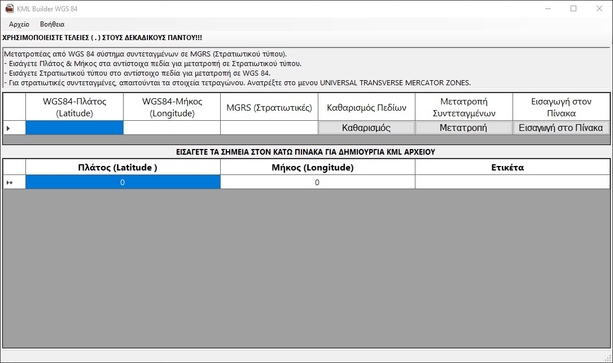

# KMLBuilder

Βοήθημα δημιουργίας αρχείων KML με την έκδοση 2.2, από συντεταγμένες WGS 84.

## Δυνατότητες

* Άνοιγμα και επεξεργασία αρχείων KML 2.2, για τα πεδία μήκος, πλάτος και όνομα σημείου.
* Αποθήκευση ως KML 2.2
* Αποθήκευση ως απλό κείμενο
* Αποθήκευση ως αρχείο Comma Separated Values (CSV), για εύκολη φόρτωση σε EXCEL, κλπ
* Μετατροπή συντεταγμένων από WGS 84 σε MGRS (Στρατιωτικού τύπου) και από MGRS σε WGS 84

## Γενικά

Το βοήθημα, είναι γραμμένο σε περιβάλον .net 8 (https://dotnet.microsoft.com/en-us/download/dotnet/8.0)
και χρησιμοποιεί το γραφικό περιβάλον WinForms (https://github.com/dotnet/winforms).
Επίσης χρησιμοποιείται βιβλιοθήκη συντεταγμένων τρίτων CoordinateSharp 2.24.2.1 (https://github.com/Tronald/CoordinateSharp)

## Πακετάρισμα και Ανάγκες Εκτέλεσης

Το εκτελέσιμο, περιλαμβάνει όλες τις απαιτήσεις (build & packaged as self contained executable framework independent)
https://learn.microsoft.com/en-us/dotnet/core/deploying/#publish-self-contained για παραπάνω πληροφορίες.
Το build είναι 32bit για μεγαλύτερη συμβατότητα.

**Δεν απαιτεί εγκατάσταση**

Έχει δοκιμαστεί σε περιβάλον Windows 10

## Μεταφορτωση (Download)

Το εκτελέσιμο αρχείο, είναι διαθέσιμο σε συμπιεσμένη μορφή zip από τη διεύθυνση:
https://github.com/stef-k/KMLBuilder/releases/download/1.0.0.0/KMLBuilder-20-Oct-24.zip

## Πηγαίος Κώδικας

Ο πηγαίος κώδικας της εφαρμογής, είναι διαθέσιμος από τη σελίδα του project, στη διεύθυνση:
https://github.com/stef-k/KMLBuilder
